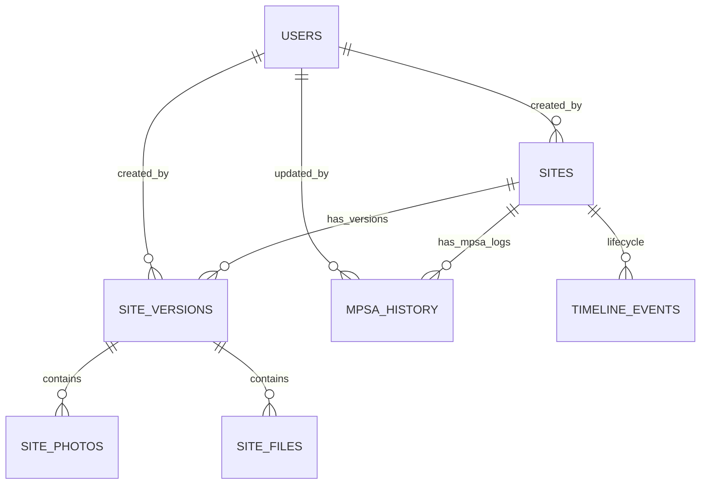

# DATABASE_SCHEMA.MD - THIẾT KẾ CƠ SỞ DỮ LIỆU (UPDATED v2.0)

Tài liệu này mô tả chi tiết sơ đồ cơ sở dữ liệu PostgreSQL cho dự án Site Management Web (POC) hỗ trợ **Gate Pipeline & Versioning**.

## 1. Sơ đồ Thực thể (ERD)



## 2. Định nghĩa các kiểu dữ liệu ENUM (Updated)

- **UserRole**: `MB`, `BOD_L1`, `BOD_L2`, `PROJECT`, `ADMIN`
- **SiteStatus**: `DRAFT`, `SUBMITTED`, `GATE1`, `GATE2`, `GATE3`, `FINISH`
- **GateName**: `SURVEY`, `SITEPACK`, `DEAL`
- **EventType**: `COMMENT`, `QUESTION`, `ANSWER`, `STATUS_CHANGE`, `DECISION`, `MPSA_UPDATE`, `VERSION_CREATED`

## 3. Chi tiết các bảng (Tables)

### Bảng: `users`
| Column | Type | Constraints | Description |
|---|---|---|---|
| role | UserRole | NOT NULL | Thêm BOD_L1, BOD_L2. |
| brand | VARCHAR(50) | | Brand quản lý (Dành cho BOD_L2). |

### Bảng: `sites`
| Column | Type | Constraints | Description |
|---|---|---|---|
| brand | VARCHAR(50) | NOT NULL | Brand của mặt bằng (Bắt buộc). ⭐ |
| status | SiteStatus | DEFAULT 'DRAFT' | Cập nhật theo Gate 1-2-3. |

### Bảng: `site_versions` ⭐ NEW
Lưu snapshot dữ liệu tại các mốc quan trọng (Submit, Gate 3).
| Column | Type | Constraints | Description |
|---|---|---|---|
| id | UUID | PRIMARY KEY | |
| site_id | UUID | FK -> sites(id) | |
| version_number | INTEGER | (1 or 2) | |
| data_json | JSONB | NOT NULL | Snapshot toàn bộ fields của site. |
| created_by | UUID | FK -> users(id) | |
| created_at | TIMESTAMPTZ | | |

### Bảng: `mpsa_history` ⭐ NEW
| Column | Type | Constraints | Description |
|---|---|---|---|
| id | UUID | PRIMARY KEY | |
| site_id | UUID | FK -> sites(id) | |
| mpsa_value | NUMERIC(15,2) | NOT NULL | |
| updated_by | UUID | FK -> users(id) | |
| updated_at | TIMESTAMPTZ | | |
| note | TEXT | | |

### Bảng: `timeline_events`
| Column | Type | Constraints | Description |
|---|---|---|---|
| stage_at_time | SiteStatus | NOT NULL | Lưu Stage/Gate tại thời điểm tạo sự kiện. ⭐ |

## 4. SQL DDL (Tham khảo - Bổ sung)

```sql
CREATE TYPE user_role AS ENUM ('MB', 'BOD_L1', 'BOD_L2', 'PROJECT', 'ADMIN');
CREATE TYPE site_status AS ENUM ('DRAFT', 'SUBMITTED', 'GATE1', 'GATE2', 'GATE3', 'FINISH');

CREATE TABLE site_versions (
    id UUID PRIMARY KEY DEFAULT uuid_generate_v4(),
    site_id UUID REFERENCES sites(id),
    version_number INTEGER NOT NULL,
    data_json JSONB NOT NULL,
    created_by UUID REFERENCES users(id),
    created_at TIMESTAMPTZ DEFAULT NOW()
);

CREATE TABLE mpsa_history (
    id UUID PRIMARY KEY DEFAULT uuid_generate_v4(),
    site_id UUID REFERENCES sites(id),
    mpsa_value NUMERIC(15,2) NOT NULL,
    updated_by UUID REFERENCES users(id),
    updated_at TIMESTAMPTZ DEFAULT NOW(),
    note TEXT
);
```
